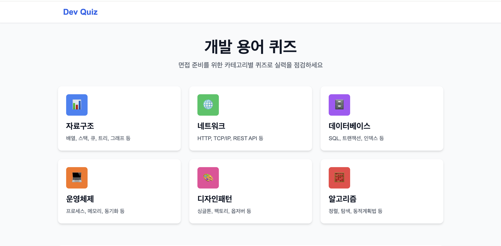
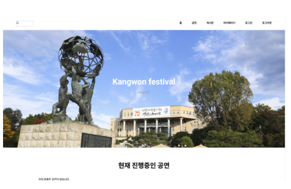

# 김재훈 | Backend Developer

<div align="center">


**"기획부터 운영까지, AI 도구를 활용할 줄 아는 생산성 높은 개발자"**

요구사항을 명확히 파악하고 다양한 리더, 팔로워 경험으로 팀과 적극적으로 소통하며 문제를 해결합니다.

회의 결정사항을 문서화하여 협업 효율을 높이고, 기술적 난관에 유연하게 대처합니다.

[](https://github.com/doublejh0501)
[](mailto:jaehun1417@gmail.com)

</div>

---

## 🚀 Projects

### 1. Backend Developer Intern | 소프트랩스 (SoftLabs)
**2025.11 - 2025.12 (2개월) | 팀 프로젝트 (5명) | 실무 인턴십**

> 패션 블로그 자동 생성 시스템 개발 (Fashion 크롤링, AI 통합, BlogTemplate 도메인)

#### 주요 성과
- **Chrome DevTools로 E-commerce 내부 API 발굴**: XHR 요청 분석하여 JSON API 엔드포인트 발견, Java RestClient로 구현
- **PostgreSQL 배열 타입 제안 및 적용**: 정규화 없이 `colors[]`, `seasons[]` 저장하여 JOIN 불필요
- **AWS EC2 배포 전체 담당**: 팀 5명 배포 가이드 작성, t3.small 인스턴스 선정 (t2.micro OOM 해결), Docker 이미지 빌드 자동화

#### Tech Stack
- Spring Boot 3.5.7, Java 21, PostgreSQL 16, Spring AI, JSoup, RestClient, AWS EC2, Docker

---

### 2. IPZY - AI 패션 코디 추천 서비스
**2025.11 - 2025.12 | 팀 프로젝트 (5명) | 부트캠프 최종 프로젝트**

> 사용자 퀴즈 분석부터 AI 추천, 코디 이미지 생성까지 자동화하는 플랫폼

#### 시스템 아키텍처

```
┌─────────────┐         ┌──────────────────┐         ┌─────────────────┐
│   Frontend  │────────▶│  Spring Boot     │────────▶│   FastAPI       │
│   (React)   │         │  (Java 21)       │         │   (Python 3.11) │
└─────────────┘         │                  │         │                 │
                        │  - Product       │         │  - OpenAI API   │
                        │  - Recommendation│         │  - ChromaDB     │
                        │  - User          │         │  - Image Process│
                        └─────────┬────────┘         └────────┬────────┘
                                  │                           │
                        ┌─────────▼────────┐       ┌─────────▼────────┐
                        │   PostgreSQL 16  │       │    AWS S3        │
                        │   (pgvector)     │       │  (이미지 저장)    │
                        └──────────────────┘       └──────────────────┘
```

#### 나의 역할
- **Product 도메인**: 패션 상품 크롤링, 상품 DB 설계 (단독)
- **AI 서비스**: Python FastAPI 전체 개발 (OpenAI, ChromaDB, 단독)
- **Recommendation 통합**: Java와 Python 마이크로서비스 통합 (단독)

#### 핵심 기능

**1. CLAUDE.md 기반 팀 지식 관리 체계 구축**

문제 인식:
- 회의에서 결정된 기술 선택(PostgreSQL 배열 타입, 카테고리 매핑)이 문서화 안 됨
- Claude Code에게 질문 시 팀 최신 결정사항 미반영

해결:
```markdown
# CLAUDE.md 구조
1. 프로젝트 구조: 도메인별 역할, 모듈 간 관계
2. 코딩 컨벤션: @Transactional 필수, DTO는 record
3. 회의 결정사항 (날짜별):
   - "2025.11.20: PostgreSQL 배열 타입 사용 (정규화 대신)"
   - "2025.11.22: 무신사 크롤링 1초 지연 (봇 탐지 우회)"
```

결과:
- Claude Code가 팀 결정사항 이해, 일관된 코드 생성
- 신규 팀원 온보딩 시간 단축

**2. AI 추천 시스템 (Python FastAPI)**

기술 선택:
- **FastAPI**: OpenAI API 비동기 호출, Pydantic 타입 안전성, 자동 Swagger
- **ChromaDB**: Pinecone 대비 무료, Docker 로컬 운영

프롬프트 엔지니어링:
```python
# 초기 (문제)
"코디 추천해줘" → 이상한 조합 (상의 3개, 하의 0개)

# 개선 (해결)
"상의 1개, 하의 1개, 신발 1개, 색상 계열 통일" 명시
→ 추천 품질 향상
```

**3. 마이크로서비스 통합**
- Java RestClient로 Python FastAPI 호출
- TreeSet으로 중복 조합 회피
- 타임아웃 설정 (연결 5초, 읽기 60초)

#### 배포 및 운영
- AWS EC2 배포 전체 담당 (팀원 배포 가이드 작성)
- Docker Compose로 Java/Python 마이크로서비스 통합 배포
- 환경 변수 관리 (.env), AWS S3 이미지 저장소 구성

#### Tech Stack
- **Backend**: Spring Boot 3.2.0, Java 21, PostgreSQL 16 (pgvector)
- **AI Service**: FastAPI 0.109.0, Python 3.11, OpenAI API, ChromaDB
- **Image**: Pillow, rembg (U2-Net)
- **Infrastructure**: AWS EC2, Docker Compose, AWS S3
- **Frontend**: React 19, TypeScript 5.9, Vercel
- **Testing**: JUnit 5, Mockito, pytest

#### GitHub
- [Backend Repository](https://github.com/cryschan/ipzy-backend)
- [AI Service Repository](https://github.com/cryschan/ipzy-ai)

---

### 3. Musinsa Price Tracker - 무신사 가격 추적 시스템
**2026.03 (1주) | 개인 프로젝트**

> 소프트랩스 Java 크롤링 경험을 Node.js로 재구현 (FETCHING 지원 대비)

#### 프로젝트 개요
소프트랩스 인턴에서 Java로 패션 크롤링을 경험한 후, Node.js 생태계 학습을 위해 같은 도메인(무신사 크롤링)을 NestJS로 재구현한 프로젝트.

**목표**: Java와 Node.js의 비동기 처리 방식 차이를 실전으로 학습

#### 시스템 아키텍처

```
┌─────────────┐         ┌──────────────────┐         ┌─────────────────┐
│   Crawler   │────────▶│     NestJS       │────────▶│     MySQL       │
│  (Axios)    │         │  (TypeScript)    │         │  (TypeORM)      │
└─────────────┘         │                  │         │                 │
                        │  - Products API  │         │  - products     │
                        │  - Crawler API   │         │  - price_history│
                        └──────────────────┘         └─────────────────┘
```

#### 주요 기능

**1. 무신사 API 리버스 엔지니어링**

초기 시도 (실패):
- Puppeteer 헤드리스 브라우저로 HTML 파싱
- 무신사 SPA 구조로 변경되어 동적 렌더링 실패
- 느리고 복잡함

최종 구현 (성공):
```typescript
// Chrome DevTools로 발견한 무신사 내부 API
const apiUrl = 'https://api.musinsa.com/api2/dp/v2/plp/goods?brand=nike&category=103';
const response = await axios.get(apiUrl);
const products = response.data.data.list; // 30개 상품
```

성과:
- 30개 나이키 신발 실시간 수집 (에어맥스, 에어조던 등)
- Puppeteer 대비 10배 빠른 응답 속도

**2. 가격 변동 추적 시스템**

문제: 매번 히스토리 저장 시 불필요한 데이터 증가

해결:
```typescript
// 가격이 실제로 변경되었을 때만 히스토리 저장
if (product.price !== productData.price) {
  await this.createHistory(product); // 변동 시에만 저장
}
```

성과:
- 아스트로그래버: 139,000원 → 125,100원 (10% 할인 감지)
- 불필요한 데이터 저장 방지

**3. Java vs Node.js 비교**

| 항목 | Java (소프트랩스) | Node.js (이 프로젝트) |
|------|------------------|---------------------|
| HTTP | RestClient | Axios |
| 파싱 | JSoup | 무신사 API 직접 호출 |
| I/O | 블로킹 | 논블로킹 (async/await) |
| 프레임워크 | Spring Boot | NestJS |
| ORM | JPA | TypeORM |

학습 포인트:
- **블로킹 vs 논블로킹**: Java는 응답 대기 중 스레드 block, Node.js는 이벤트 루프가 다른 작업 처리
- **async/await**: 비동기 코드를 동기처럼 작성 가능
- **NestJS**: Spring Boot와 유사한 DI, Module 구조

#### Tech Stack
- **Backend**: NestJS, TypeScript, TypeORM, MySQL 8.0
- **Crawler**: Axios, 무신사 API
- **Infrastructure**: Docker Compose
- **Documentation**: Swagger UI

#### 프로젝트 규모
- Backend: 800+ 라인 (TypeScript)
- REST API: 6개 엔드포인트
- 30개 상품 추적, 가격 히스토리 자동 관리

#### GitHub
[Repository](https://github.com/doublejh0501/musinsa-price-tracker)

---

### 4. Dev Quiz - 개발 용어 퀴즈 플랫폼
**2026.03 (2주) | 개인 프로젝트**

> Reactive Programming 학습 및 면접 대비를 위한 개발 용어 퀴즈 플랫폼



#### 프로젝트 개요
면접 준비를 위한 개발 용어 학습 플랫폼. Spring WebFlux + R2DBC로 Reactive Programming 실습.

#### 시스템 아키텍처

```
┌─────────────┐         ┌──────────────────┐         ┌─────────────────┐
│   Next.js   │────────▶│  Spring WebFlux  │────────▶│  PostgreSQL     │
│ (TypeScript)│         │  (Kotlin)        │         │  (R2DBC)        │
└─────────────┘         │                  │         │                 │
                        │  - REST API      │         │  - 6 카테고리   │
                        │  - Reactive      │         │  - 42 문제      │
                        └─────────┬────────┘         └─────────────────┘
                                  │
                        ┌─────────▼────────┐
                        │     Redis        │
                        │   (캐싱)         │
                        └──────────────────┘
```

#### 주요 기능

**1. Reactive Programming (Spring WebFlux + R2DBC)**

기술 선택:
- **Spring WebFlux**: 비동기 논블로킹 I/O, Reactive Streams (Mono, Flux)
- **R2DBC**: Reactive Database 드라이버, 비동기 쿼리 실행

구현:
```kotlin
@GetMapping("/api/quizzes")
fun getAllQuizzes(): Flux<QuizResponse> {
    return quizRepository.findAll()
        .map { it.toResponse() }
        .limitRate(10) // 백프레셔 관리
}
```

결과:
- 동시성 처리 향상 (메모리 효율적)
- 비동기 논블로킹으로 응답 속도 개선

**2. TypeScript + Kotlin 타입 안정성**

```typescript
// TypeScript
interface QuizResponse {
  id: number;
  question: string;
  options: string[];
  correctAnswer: string;
  category: string;
}
```

```kotlin
// Kotlin
data class QuizResponse(
    val id: Long,
    val question: String,
    val options: List<String>,
    val correctAnswer: String,
    val category: String
)
```

결과:
- 양방향 타입 체크로 런타임 에러 최소화
- API 변경 시 컴파일 타임 에러로 조기 발견

**3. 테스트 주도 개발 (TDD)**

```kotlin
@Test
fun `퀴즈 조회 API 테스트`() {
    webTestClient.get()
        .uri("/api/quizzes/1")
        .exchange()
        .expectStatus().isOk
        .expectBody<QuizResponse>()
        .consumeWith { response ->
            assertThat(response.responseBody?.id).isEqualTo(1)
        }
}
```

테스트 커버리지:
- 7개 테스트 메서드 (QuestionServiceTest)
- JUnit 5 + MockK 단위 테스트
- Reactive 비동기 테스트 (StepVerifier로 Mono/Flux 검증)
- WebTestClient로 비동기 API 통합 테스트
- Repository 모킹 및 Service 계층 단위 테스트

**4. Next.js 15 App Router**

```
app/
├── page.tsx (메인 페이지)
├── quiz/
│   └── [category]/
│       └── page.tsx (카테고리별 퀴즈)
└── layout.tsx (공통 레이아웃)
```

특징:
- Server Components 기본 지원 (성능 향상)
- 동적 라우팅 간소화
- TailwindCSS 반응형 디자인

#### Tech Stack
- **Backend**: Kotlin, Spring Boot 3.2, WebFlux, R2DBC, PostgreSQL 16, Redis 7
- **Frontend**: Next.js 15, TypeScript, TailwindCSS
- **Testing**: JUnit 5, MockK (10개 테스트)
- **Documentation**: Swagger UI (SpringDoc OpenAPI)
- **Infrastructure**: Docker Compose

#### 프로젝트 규모
- Backend: 1,700+ 라인 (Kotlin)
- Frontend: 800+ 라인 (TypeScript)
- 6개 REST API 엔드포인트
- 6개 카테고리, 42개 샘플 데이터

#### GitHub
[Repository](https://github.com/doublejh0501/quizdispensor)

---

### 5. NGS gamecamp - Steam 게임 판매 플랫폼
**2025.09 - 2025.10 | 팀 프로젝트 (6명)**

> Steam API 연동 게임 정보 수집 + 소셜 로그인 + 결제 시스템

#### 나의 역할
User, Security 모듈 (단독)

#### 주요 기능

**1. JWT + OAuth2 인증 시스템**

기술 선택:
- **JWT Stateless**: 수평 확장 용이, Redis 불필요
- **HttpOnly 쿠키**: XSS 공격 방어, Access Token 6시간

구현:
- Google, Kakao, Naver OAuth2 통합 (provider별 attribute 매핑)
- 커스텀 필터로 Authorization 헤더 + HttpOnly 쿠키 동시 인증

**2. 동시성 환경 팔로우 중복 방지**

문제:
- 같은 사용자를 동시에 여러 번 팔로우하면 중복 insert 가능성
- 서비스 로직만으로는 동시 요청 시 중복 체크 통과

해결:
```java
// DB 제약
@UniqueConstraint(columnNames = {"user_id", "target_type", "target_id"})

// 서비스 로직
if (followRepository.existsByUserIdAndTargetTypeAndTargetId(...)) {
    throw new IllegalArgumentException("이미 팔로우 한 상태입니다");
}
```

결과: 동시 요청에도 중복 방지 + 명확한 에러 메시지

#### 테스트
- 29개 테스트 파일 (Service, Controller, Repository 계층)
- JUnit 5 + Mockito 단위 테스트
- OAuth2 인증 통합 테스트 (Google, Kakao, Naver)
- 팔로우 서비스, 주문/결제 통합 테스트

#### Tech Stack
- Spring Boot 3.5.5, Java 21, MySQL 8.0, JWT, OAuth2
- Testing: JUnit 5, Mockito

#### GitHub
[Repository](https://github.com/doublejh0501/BE_Repository)

---

### 6. Bookstore - Yes24 스타일 도서 판매 사이트
**2025.08 - 2025.10 | 팀 프로젝트 (3명)**

> 온라인 서점 플랫폼

#### 나의 역할
팀 리더 + Order 모듈 (단독)

#### 주요 성과

**1. 팀 리더십**
- 프로젝트 전체 구조 설계: User, Book, Order 도메인 분담
- 기술 스택 선정: Spring Boot, MySQL, Redis, KakaoPay API
- Git 브랜치 전략: feature → develop → main
- 주간 회의 주도, 코드 리뷰 프로세스 운영

**2. Order 모듈 - 주문-재고 트랜잭션 처리**

```java
@Transactional
public Order createOrder(OrderRequest request) {
    // 1. 재고 확인 (부족 시 즉시 실패)
    if (book.getStock() < request.getQuantity()) {
        throw new OutOfStockException();
    }

    // 2. 주문 생성 + 재고 차감
    Order order = orderRepository.save(new Order(...));
    book.decreaseStock(request.getQuantity());

    // 3. 결제 처리
    paymentService.pay(order);

    // 성공: 커밋, 실패: 롤백 (재고 복원)
    return order;
}
```

결과: 동시성 문제 없이 데이터 일관성 유지

#### 테스트
- OrderServiceTest: 15개 테스트 메서드
- JUnit 5 + Mockito (ArgumentCaptor로 메서드 호출 검증)
- 트랜잭션 통합 테스트 (주문-결제-재고 연계)
- 결제 실패 시 롤백 검증, 재고 부족 등 edge case 커버

#### Tech Stack
- Spring Boot 3.5, Java 21, MySQL 8.0, Redis 7, KakaoPay API
- Testing: JUnit 5, Mockito

#### GitHub
[Repository](https://github.com/doublejh0501/Bookstore)

---

### 7. TicketingPlatform - 공연 예매 플랫폼
**2024.09 - 2024.12 | 팀 프로젝트 (5명)**

> 공연 정보 조회, 좌석 선택, 예매, 커뮤니티 기능



#### 나의 역할
팀 리더 + Frontend Developer + Controller

#### 주요 구현

**1. 팀 리더십**
- 프로젝트 도메인 분담 (Performance, Reservation, User, Community)
- 기술 스택 선정 (Spring Boot 3.2.4, Java 17, Thymeleaf, H2)
- Git 브랜치 전략 및 협업 프로세스 정립

**2. 전역 UI/UX 체계 구축**
- 전역 헤더, 푸터, 네비게이션 바 설계
- 공통 CSS/JS 컴포넌트화로 화면 일관성 확보
- 반응형 디자인 적용

**3. 공연 예매 시스템 UI**
- JavaScript 기반 동적 좌석 선택
- 실시간 예약 상태 표시 (예약 가능/선택됨/예약 완료)
- AJAX 비동기 처리 (댓글 작성/수정/삭제)

**4. Spring Security 연동 UI**
- Thymeleaf로 로그인/OAuth 버튼 구현
- CSRF 토큰 hidden input 처리
- Security 태그로 권한별 메뉴 동적 표시/숨김

#### Tech Stack
- Spring Boot 3.2.4, Java 17, Thymeleaf, H2, Spring Security
- Frontend: HTML5, CSS3, JavaScript ES6

#### GitHub
[Repository](https://github.com/jjunh0/TicketingPlatform)

---

### 8. Lang잔고를 부탁해 - AI 대출 상담 챗봇
**2025.10 - 2025.11 | 팀 프로젝트 (4명)**

> LangChain 기반 AI 대출 상담 챗봇

#### 나의 역할
팀 리더 + Compute Policies 모듈

#### 시스템 아키텍처

```
사용자 질문 → ChromaDB 검색 → LLM 응답 생성 → 금융 계산 엔진 → 대출 가능 여부 판단
```

#### 주요 성과

**1. 팀 리더십 및 문서화**
- 금융 계산 엔진 구조 설계 (LTV, DTI, DSR)
- README 작성: 프로젝트 개요, 실행 방법, 환경 변수 설정 가이드
- 시스템 흐름도, API 문서, 테스트 케이스 문서화
- Slack 주간 회고: 완료 작업, 다음 주 계획, 이슈 해결 방법 공유

**2. Compute Policies 모듈**
- LTV, DTI, DSR 계산 로직
- 대출 가능 여부 판단
- 정책 파라미터 버전 관리

#### Tech Stack
- Python 3.11, LangChain, LangGraph, ChromaDB, FastAPI

#### GitHub
[Repository](https://github.com/doublejh0501/Loanchat_dev)

---

## 🛠 Technical Skills

### Backend
- **Java 21, Spring Boot 3.x**: JPA, Security, RESTful API
- **Kotlin, Spring Boot 3.2**: WebFlux (Reactive Programming), R2DBC
- **Python 3.11, FastAPI**: 비동기 웹 프레임워크

### Frontend
- **Next.js 15**: App Router, Server Components
- **TypeScript, TailwindCSS**
- **React 19**

### Database
- **PostgreSQL 16**: 배열 타입, JSONB, pgvector, R2DBC (Reactive)
- **MySQL 8.0**: 인덱스 최적화, 트랜잭션 관리
- **Redis 7**: 캐싱

### AI & Vector DB
- **OpenAI API**: GPT-3.5-turbo, 프롬프트 엔지니어링
- **ChromaDB**: 벡터 검색
- **LangChain/LangGraph**: RAG 파이프라인

### Web Crawling
- **JSoup**: HTML 파싱
- **RestClient** (Spring 6.1+): REST API 크롤링

### Testing
- **JUnit 5**: Mockito (Java), MockK (Kotlin)
- **pytest**: Python 단위 테스트
- **WebTestClient**: WebFlux 비동기 테스트

### Infrastructure
- **AWS**: EC2 (t3.small)
- **Docker**: 멀티 스테이지 빌드, Docker Compose

### Tools
- **Git/GitHub**: Conventional Commits (feat:, fix:, docs:)
- **CodeRabbit**: AI 코드 리뷰
- **Swagger**: API 문서화
- **Slack**: 팀 커뮤니케이션

---

## 🤖 AI 활용 능력

**팀 협업 최적화**
- **CLAUDE.md 기반 팀 지식 관리**: 회의 결정사항 문서화, Claude Code가 팀 맥락 이해

**개발 생산성 도구**
- **Claude Code (Sonnet 4.5)**: 크롤링 로직, 테스트 코드 작성
- **GitHub Copilot**: DTO, Entity 자동 완성
- **ChatGPT**: 기술 스택 비교, 에러 디버깅

**AI 프로젝트 경험**
- OpenAI API 프롬프트 엔지니어링
- CodeRabbit AI 코드 리뷰

---

## 🎓 Education

**패스트캠퍼스 AI융합 백엔드 개발 부트캠프**
2025.06 - 2025.12 | 서울 강남
- 6개월 풀타임 (Java, Spring Boot, Python, AI)
- 5개 팀 프로젝트, Git 협업 경험

**강원대학교 컴퓨터공학 학사 졸업**
2019.03 - 2025.08 | 강원 춘천

---

## 📜 Certifications

- SQLD (SQL 개발자) (2025)
- 정보처리기사 (2025)

---

## 🌐 Language

- TOEIC 865점 (2025)
- 영문 기술 문서 독해 가능

---

## 📫 Contact

- **Email**: jaehun1417@gmail.com
- **Phone**: 010-8801-9685
- **GitHub**: https://github.com/doublejh0501
- **Location**: 경기도 남양주시

---

**최종 업데이트**: 2026.03.30
